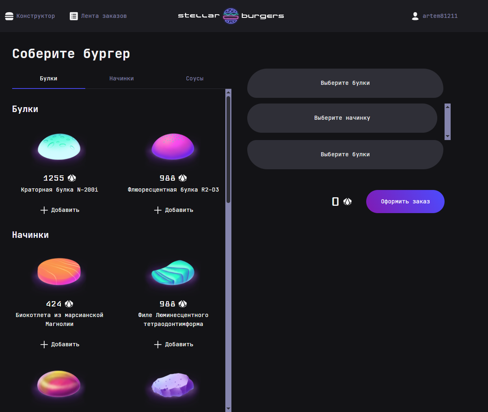
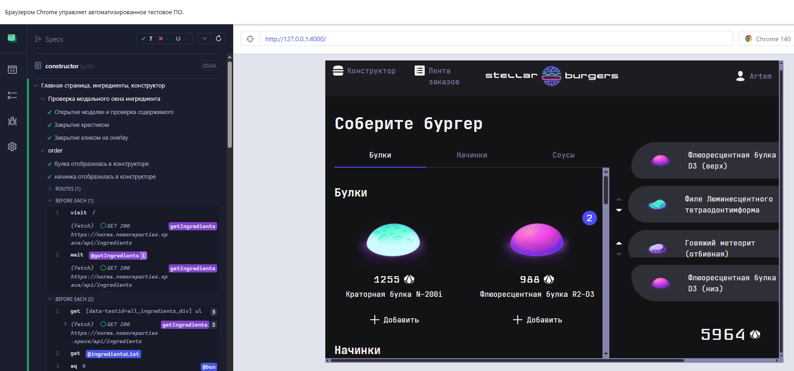

# Проектная работа 11 и 12-го (в работе) спринтов

# Stellar Burgers

**Проект "Stellar Burgers"** — это учебное React-приложение для сборки космических бургеров. Проект был получен в виде заготовки (компоненты, базовая структура), после чего доработан:

- реализована бизнес-логика приложения;
- подключено и настроено тестирование:
  - e2e-тесты через **Cypress**;
  - unit-тесты через **Jest**.

### Сборка бургера


### Тестирование cypress



## Функциональность

- Просмотр ингредиентов с подробностями
- Сборка бургера из булок, соусов и начинок
- Оформление заказа
- Проверка визуальных и функциональных частей через Cypress
- Мокирование сетевых запросов

## Стек технологий

- **React** + **TypeScript**
- **React Router v6**
- **Redux Toolkit** (слайсы, хранилище)
- **Jest** + `@testing-library/react` — для юнит-тестов
- **Cypress** — для e2e-тестов
- **CSS Modules** + SCSS
- **Webpack 5**

## Тесты

> В проект добавлено два уровня тестирования:

- **Unit-тесты**: тестирование компонентов, редьюсеров, асинхронных экшенов
- **E2E-тесты**: полные сценарии работы пользователя, включая мокирование API через `cy.intercept`

Примеры:
- Проверка модального окна ингредиента
- Проверка логина через мок
- Проверка оформления заказа и очистки конструктора


## 11 спринт:

**Для корректной работы запросов к серверу необходимо** добавить переменную BURGER_API_URL в окружение.
Для этого содержимое файла `.env.example` нужно скопировать в файл `.env`

для локального запуска
* удалить строку с homepage в файде package.json
* посмотреть порт на котором запускается в конце файла webpack.config.js
* в корневой папке создать файл .env и скопировать туда содержимое из .env.example

после этого выполнить следующие команды

```
npm install
npm i react-router-dom
npm i -D @types/react-router-dom
npm install @reduxjs/toolkit react-redux
npm start
```


StoreBook
```
npx storybook@latest init
npm run storybook
```

## 12 спринт:

### Настройка Cypress
```
npm install cypress --save-dev 
npm install ts-node --save-dev
```
одновременно запускаем 
* приложение stella-burgers в терминале
```
 npm start
 ```
* cypress в vscode или в другом терминале
```
npx cypress open
```

### Настройка Jest

```
npm install --save-dev jest
npm install --save-dev ts-jest ts-node
npm install --save-dev @jest/globals
```
запуск
```
npm run test
```
